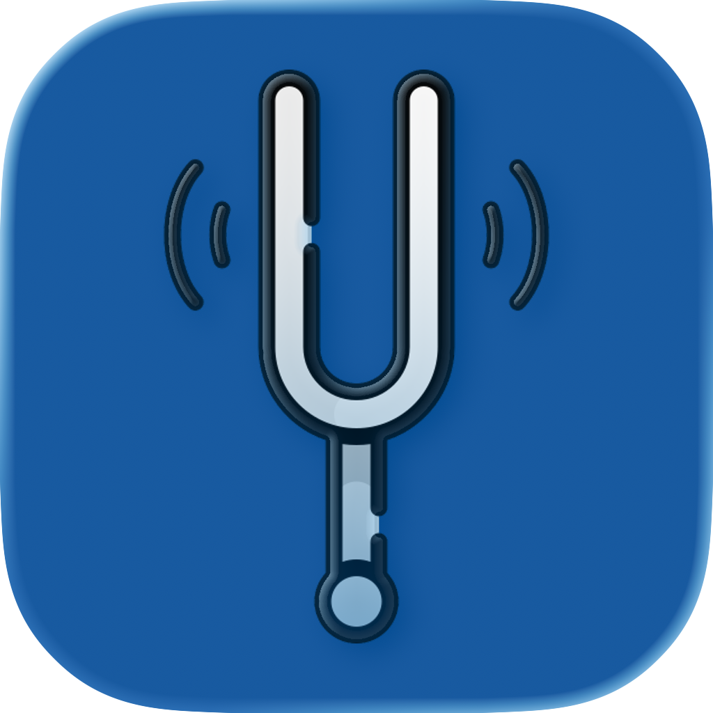

<h1 align="center">
  <a href="https://github.com/Nytuo/Diapason_iOS">
    
  </a>
</h1>

<div align="center">
<h2>Diapason for iOS</h2>
Diapason native iOS music player for Subsonic, Plex, and local libraries
<br />
<br />
<a href="https://github.com/Nytuo/Diapason_iOS/issues/new?assignees=&labels=bug&template=01_BUG_REPORT.md&title=bug%3A+">Report a Bug</a>
·
<a href="https://github.com/Nytuo/Diapason_iOS/issues/new?assignees=&labels=enhancement&template=02_FEATURE_REQUEST.md&title=feat%3A+">Request a Feature</a>
·
<a href="https://github.com/Nytuo/Diapason_iOS/discussions">Ask a Question</a>
</div>

<div align="center">
<br />

[](https://github.com/Nytuo)

</div>

<details open="open">
<summary>Table of Contents</summary>

- [About](#about)
- [Features](#features)
- [Technologies](#technologies)
- [Getting Started](#getting-started)
  - [Prerequisites](#prerequisites)
  - [Build \& run](#build--run)
  - [First launch](#first-launch)
- [Architecture](#architecture)
- [Authors \& contributors](#authors--contributors)
- [License](#license)

</details>

---

## About

Diapason for iOS is a fully native SwiftUI music client for iPhone and iPad. It connects to your Subsonic / Navidrome or Plex server, or browses your on-device local files, and delivers an Apple Music-style experience with a glassmorphic full-screen player, karaoke-style synced lyrics, and deep OS integration for lock-screen controls and background audio.

It is part of the [Diapason](https://github.com/Nytuo/Diapason) ecosystem and speaks the **Diapason Connect** protocol, letting you control the desktop app from your phone or use your phone as a playback receiver.

## Features

**Playback**
- AVFoundation-based audio with gapless playback support
- Background audio
- Lock-screen controls
- Playback cache manager for smooth streaming

**Library**
- Subsonic / Navidrome server support
- Plex Media Server support
- Local file library via folder picker
- Album, Artist, Song, Playlist, and Folder views
- Full-text search

**Now Playing**
- Glassmorphic full-screen player with dynamic animated background
- Karaoke-style synced lyrics viewer with tap-to-seek
- System volume slider
- Queue management

**Diapason Connect**
- Bonjour / mDNS auto-discovery of Diapason desktop instances on the LAN
- Control the desktop app from your phone
- Use the iOS app as a playback receiver

**Discovery & Scrobbling**
- Last.fm scrobbling + Now Playing
- ListenBrainz scrobbling
- Music discovery via Last.fm / ListenBrainz playlist generation
- YouTube / yt-dlp track resolution for discovered songs
- Offline downloads

**Other**
- Playlist management (create, edit, reorder)
- i18n: English + French
- iOS 16+ target

## Technologies

<div style="display: flex; align-items: center; gap: 10px;">
  
  
  
  
  
</div>

## Getting Started

### Prerequisites

- macOS with **Xcode 15+** installed
- **XcodeGen** (`brew install xcodegen`)
- An iOS 16+ device or simulator

### Build & run

```bash
# 1. Clone the repo
git clone https://github.com/Nytuo/Diapason_iOS.git
cd Diapason_iOS

# 2. Generate the Xcode project
cd src
xcodegen generate

# 3. Open in Xcode and run
open Diapason.xcodeproj
# Select your device or simulator and press Run (⌘R)
```

### First launch

Open the **Settings** tab and enter your server details:
- **Subsonic / Navidrome** — server URL, username, password
- **Plex** — server URL + token
- **Local files** — tap the folder picker to grant access to your music folder

## Architecture

```
SwiftUI Views  (src/Sources/Views/)
  ↓  @StateObject / @ObservedObject
Managers
  ├── PlayerManager       — AVPlayer queue + transport
  ├── BackendManager      — selects active backend
  ├── DiscoveryManager    — Last.fm / ListenBrainz discovery
  ├── ConnectManager      — Diapason Connect TCP protocol
  └── DesktopDiapasonBrowser — Bonjour/mDNS LAN discovery
  ↓
UnifiedMusicClient  (Subsonic / Plex / Local abstraction)
  ├── SubsonicClient
  ├── PlexClient
  └── LocalMusicManager
  ↓
AVPlayer (audio)  +  URLSession (API calls)
  ↓ optional
Scrobbler → LastFmClient / ListenBrainzClient
YouTubeResolver → yt-dlp
```

## Authors & contributors

Created by [Arnaud BEUX](https://github.com/Nytuo).

For a full list of contributors, see the [contributors page](https://github.com/Nytuo/Diapason_iOS/contributors).

## License

Diapason for iOS is licensed under the **GNU General Public License v3**.
See [LICENSE](LICENSE) for more information.
